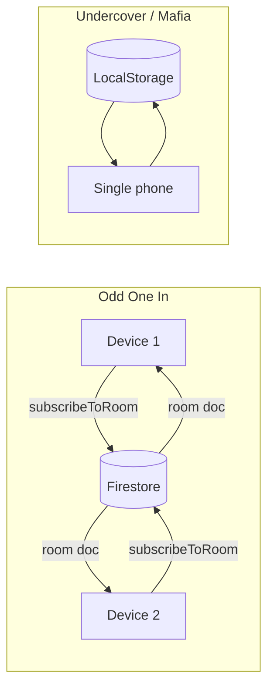

# Implementation Spec – Meenit's Playground

This document is the single source of truth for game rules, UI/UX, state, and implementation details. Reference it before implementing or changing behavior.

---

## Rules corrections (critical)

- **Mafia – Night phase:** The Game Master does **not** record Mafia victim or Doctor save in the app. The GM tracks these **mentally**. **Only Lover protection** is recorded in the app (Lover selects target in the app, round 1 only). Morning: GM tells the app who died based on memory; the app applies Lover → Doctor → death order and shows the correct message.
- **Undercover – Role display:** Mr. White sees **"You're Mr. White"** (they know their role). Spy and Agent **both** see **"Agent / Spy"** (ambiguous; they do not know which they are). This is the core deception mechanic.
- **Odd One In – Copy feedback:** Use "Copied!" toast or inline feedback when the invite link is copied; do not use `alert()`. When a player is kicked, show "You were removed" and redirect; optionally clear stored room code.

---

## 1. Odd One In

### 1.1 Invite and share

- **Invite URL pattern:** `{origin}/odd-one-in/join?room={code}` (e.g. `https://example.com/odd-one-in/join?room=1234`).
- **WhatsApp share:** When the user taps "Share via WhatsApp", use the Web Share API when available; otherwise open `https://wa.me/?text={encodeURIComponent(message)}`.
- **Exact message format:** `Join my Odd One In game! Room code: {code}. Link: {inviteLink}`.
- **Copy link:** Copy `inviteLink` to clipboard. Show **"Copied!"** feedback (toast or inline text that appears for ~2s); do not use `alert()`. On clipboard failure, show a fallback message (e.g. "Could not copy; copy the link manually").

### 1.2 Player removal

- **Removed player:** When the current user's `playerId` is not in `room.players` (e.g. after GM kicks them), show a clear message: e.g. "You were removed from the room." Redirect to Join screen or Home. Optionally clear the stored room code so they do not re-subscribe.
- **GM removes themselves:** Define behavior: e.g. GM can "Close room" which sets room status to `closed` and ends the game for everyone; do not allow GM to "kick" themselves as a normal player (or treat it as "close room").

### 1.3 GM powers during question round

- **Pause / Resume / Reset / Skip / Edit:** Document that GM can pause, resume, reset timer, skip to review, and edit question (if implemented).
- **Visual feedback to all players:** When the timer is paused, all clients should see a frozen timer and optionally a small banner: e.g. "Timer paused by GM." When GM resumes or resets, all see the updated timer via Firestore.
- **During pause:** Other players' screens show the same question; timer is frozen; no new answers accepted until resume (or as per backend rules).
- **Edit question:** If supported, update `currentRound.questionText` in Firestore; all clients receive the update via `subscribeToRoom` and show the new text.

### 1.4 Answer Review

- **Sorting:** Blank answers first; then non-blank answers sorted alphabetically by content (case-insensitive).
- **Duplicate highlighting:** Answers that appear more than once (same text, case-insensitive) are visually highlighted (e.g. CSS class `player-row-duplicate`).
- **Interaction:** GM multi-selects players (tap to toggle selection). Checkboxes are optional; tap-on-row is sufficient. Selected state: e.g. CSS class `player-row-selected`.
- **Real-time selection (optional):** If product requires other devices to see which answers the GM has selected, add a field (e.g. `reviewSelectedIds: string[]`) to the room document and update it on GM tap; otherwise selection is local-only.

### 1.5 State sync and reconnection

- **Source of truth:** Firestore collection `rooms`, document id = room `code`. No polling; use `subscribeToRoom(code, callback)` (Firestore `onSnapshot`).
- **LocalStorage:** Only `odd-one-in-player-id` is stored (persistent player id for re-join). No room state in LocalStorage.
- **Reconnection / refresh:** Player re-opens the same join URL with same room code; they re-join with the same `playerId` (from LocalStorage). Backend allows re-join if name matches or as per join rules.
- **Kicked player:** Once removed from `room.players`, their subscription will show `room` without them; the client must detect `!room.players.some(p => p.id === playerId)` and show "You were removed" and redirect.

### 1.6 Errors

- **Room not found:** Show error "Room not found" (or equivalent); keep user on Join form with error visible.
- **Room is closed:** Show "Room is closed"; keep user on Join form.
- **Name already taken:** Show "Name already taken in this room"; keep user on Join form.
- All errors: Stay on the same screen with error message; do not navigate away.

---

## 2. Undercover

### 2.1 Role display (core mechanic)

- **Mr. White:** Sees the title **"You're Mr. White"** and knows they are Mr. White. They see no word.
- **Spy and Agent:** Both see the **same** label **"Agent / Spy"** so they do **not** know which they are. Each sees their own word (spy word or agent word) below. This ambiguity is the core of the game.

### 2.2 Phone passing and viewing order

- **Viewing order:** Randomized at game start. One player at a time views their role; then they pass the phone to the next in order.
- **Wrap:** After the last player views, the flow goes to "Start Game" (no wrap to first for viewing).
- **Button copy:** For each viewer: "Pass phone to {nextPlayerName}". For the **last** viewer: button says **"Start Game"**.
- **Honor system:** App does not prevent the next person from seeing the previous screen; clear "Pass phone to X" and "Everyone else close your eyes" copy is used.

### 2.3 Setup – player name chips

- **Chips:** Each added name appears as a chip with a "×" (or similar). Click/tap the chip (or ×) to **remove** that name.
- **Validation:** Number of names must equal `totalPlayers` before Start is enabled. At least one Mr. White or one Spy. Agents > (Mr. White + Spy); auto-adjust total if needed. No duplicate names.

### 2.4 Elimination

- **Single selection only:** Exactly one player can be selected for elimination. Tapping another player switches selection.
- **Visual feedback:** Selected player has clear highlight/glow (e.g. `player-row-selected`).
- **Confirm button:** Disabled until exactly one player is selected; then "Eliminate Selected Player" (or equivalent) is enabled.

### 2.5 Role reveal

- **After elimination:** Show the eliminated player's **true role** (Mr. White / Spy / Agent). Use the correct **image** per role: Mr. White → `Mr. White.png`, Spy → `Spy.png`, Agent → `Agent.png` (or as per asset names).
- **Word is NOT shown** on the reveal screen (only role and image).

### 2.6 Mr. White guess

- **Instruction:** Show "Pass phone to Mr. White" (or equivalent) so the phone is handed to the Mr. White player.
- **Input:** Single text field. On submit: **trim** and **lowercase** the guess; compare with the correct word (agent word) the same way.
- **After wrong guess:** Define flow: e.g. Agents win and go to winner screen, or show "Wrong guess" and go to winner with Agents winning.

### 2.7 Current speaker

- **Suggestion only:** If the app shows a "current speaker" or similar, it is a suggestion to help the group; the app does **not** enforce speaking order.

---

## 3. Mafia

### 3.1 Night phase – mental tracking

- **GM does not record in app:** Mafia victim and Doctor save are **not** selected in the app. The GM observes physically (everyone eyes closed) and remembers.
- **Only Lover in app:** In round 1, the Lover wakes (narrated) and selects in the app who they protect. That target is stored as `loverTargetId`. No Mafia/Doctor selection UI.

### 3.2 Night phase – narration

- **UI content:** The Night screen shows **narration prompts** for the GM to read aloud (e.g. "Everyone close your eyes", "Mafia wake up…", "Doctor wake up…", "Lover wake up" only round 1, etc.). All actions (Mafia point, Doctor point) are **silent** and **eyes closed**.
- **Detective:** If enabled, Detective gets a YES/NO from the GM (e.g. GM nods or shakes head); no in-app selection for the Detective target’s role.

### 3.3 Morning results

- **GM input:** GM tells the app **who died** (from memory). Options: "No one died" or select one (or more, if design allows) victim.
- **Resolution order:** App applies logic in order: (1) **Lover protected** – if the victim is `loverTargetId`, they do not die; (2) **Doctor saved** – GM has noted mentally who Doctor saved; if victim matches, they do not die; (3) else **death**.
- **Distinct messages:** Show one of: "X was protected by the Lover", "X was saved by the Doctor", "X did not survive the night", or "No one died."

### 3.4 Lover selection (round 1 only)

- **When:** Only in **round 1** of the night phase. If `round === 1` and Lover is alive and `loverTargetId` is not set, show Lover selection.
- **Grid:** Show all alive players **except** the Lover (Lover cannot protect themselves). GM records the selection in the app.

### 3.5 Day phase

- **Discussion:** Verbal; the app does not manage speaking order. App only records the **final** group decision.
- **UI:** Selectable grid of **alive** players. One selection (or none if Skip). "Confirm Elimination" and **"Skip Elimination"**.
- **Skip Elimination:** No one is eliminated; advance to the **next round’s Night** (increment round; phase → night).

### 3.6 Jester / Bomber

- **Jester:** Show "Pass phone to Jester." Jester selects **one** player (grid). If that player is eliminated by vote, Jester wins.
- **Bomber:** Show "Pass phone to Bomber." Bomber selects **one** player (grid). That player and the Bomber are eliminated. After Bomber resolution, **check win conditions** before continuing (e.g. to Day or next phase).

### 3.7 Game Master Overview

- **Warning:** Prominent text: "DO NOT show this screen to players!" (or equivalent).
- **Content:** Grid/list of all players with their **roles** (and optionally role icons). This screen stays available for GM reference (e.g. accessible from Night or other GM screens).

### 3.8 Phone passing (role viewing)

- **Viewing order:** Randomized at game start. Last player’s button: **"Pass Phone to Game Master"** (not "Start Game"), then GM sees Overview and starts Night.

### 3.9 Validation

- **Start game:** Button **disabled** when Civilians < 1. Show helper message: e.g. "Too many special roles! Reduce roles or increase total players."

---

## 4. Cross-cutting

### 4.1 Theme and visual design

- **Per-game theme:** Each game has a distinct theme (e.g. Odd One In: red/rose accent; Undercover: green; Mafia: red). Colors can be derived from logo images in `images/` (e.g. `Odd One In Logo.png`, `Undercover Logo.png`, `Mafia Logo.png`) or set in CSS variables.
- **CSS:** Per-game theme files: `oddOneInTheme.css`, `undercoverTheme.css`, `mafiaTheme.css`. Global: `global.css`, `themes.css`.
- **Mobile-first:** Layout and touch targets sized for mobile; desktop as secondary.

### 4.2 Button and UI states

- **Buttons:** Disabled (greyed, not clickable), enabled, and active (pressed/touch) states. Use `:disabled` and `:active` (or equivalent) for touch feedback.
- **Loading:** Show loading state for async actions (e.g. "Joining…", "Creating room…").
- **Transitions:** Short transitions between screens (e.g. 0.2–0.3s) where appropriate.
- **Celebrations:** On win, optional confetti or similar feedback.

### 4.3 Navigation

- **Back button:** Define per screen whether Back goes to previous screen or Home; document for each flow.
- **Odd One In – join mid-game:** If a player joins while a round is in progress, they land in lobby or current view as per room status; document desired behavior (e.g. lobby only until next round).

### 4.4 Technical

- **Stack:** React, Vite, TypeScript.
- **Odd One In:** Firestore for room state; real-time via `subscribeToRoom`.
- **Undercover / Mafia:** Single device; state in LocalStorage (one JSON object per game); phone is passed between players.

---

## 5. State structures

Canonical types live in code; this section references them and notes semantics.

### 5.1 Odd One In – Firestore `rooms/{code}`

- **Type:** `OddRoomDoc` in `src/games/odd-one-in/services/oddBackend.ts`.
- **Key fields:** `code`, `gameName: 'odd-one-in'`, `status` (lobby | in_round | review | finished | closed), `players` (array of `OddPlayer`: id, name, isGameMaster, status, joinedAt), `gameMasterId`, `timer` (mode, questionShownAt, endsAt, durationMs, pausedAt), `currentRound` (roundIndex, questionTier, questionText, answers, phase), `winners`, `createdAt`, `updatedAt`.
- **Timestamps:** `updatedAt` (and `createdAt`) useful for debugging; Firestore `serverTimestamp()` can be used.
- **Answer Review:** GM selection is currently **local-only** (not in room doc). To sync selection to other devices, add e.g. `reviewSelectedIds: string[]` to the room document and update it when GM toggles selection.

### 5.2 Undercover – LocalStorage

- **Key:** `undercover-state-v1`.
- **Type:** `UndercoverState` in `src/games/undercover/context/UndercoverContext.tsx`.
- **Key fields:** `phase`, `players` (id, name, role, displayRole: 'MrWhite' | 'AgentOrSpy', word, isAlive), `totalPlayers`, `names`, `mrWhiteCount`, `spyCount`, `agentWord`, `spyWord`, `viewingOrder`, `viewingIndex`, `eliminatedPlayerId`, `winner`.
- **Semantics:** One JSON object per device; single phone passed around.

### 5.3 Mafia – LocalStorage

- **Key:** `mafia-state-v1`.
- **Type:** `MafiaState` in `src/games/mafia/context/MafiaContext.tsx`.
- **Key fields:** `phase`, `round`, `players` (id, name, role, isAlive), `totalPlayers`, `playerNames`, `gameMasterName`, role toggles/counts, `loverTargetId`, `nightDeathIds`, `eliminatedTodayId`, `winner`.
- **Mafia Night:** Do **not** store Mafia target or Doctor save in state. Remove or stop using `mafiaTargetId` and `doctorSaveId` in Night UI. Keep `loverTargetId` (set in round 1 Night) and `nightDeathIds` (set in Morning from GM input).

---

## 6. Validations and error cases

### 6.1 Odd One In

- Room not found → error message, stay on Join form.
- Room closed → error message, stay on Join form.
- Name already taken → error message, stay on Join form.
- Kicked player: detect when current user not in `room.players` → "You were removed", redirect, optionally clear room code.
- GM cannot start with < 3 players → Start button disabled, e.g. "Need at least 3 players".

### 6.2 Undercover

- Names count must equal total players → Start disabled, message e.g. "Please add exactly N player names!"
- At least one Mr. White or one Spy → Start disabled with message.
- Agents > (Mr. White + Spy) → auto-adjust total or show error; Start disabled until satisfied.
- Duplicate names → error message, Start disabled.

### 6.3 Mafia

- Civilians ≥ 1 → Start disabled when Civilians < 1 with helper text (e.g. "Too many special roles! Reduce roles or increase total players.").
- All player names filled and unique → validate before Start.
- Game Master name set → required.
- Morning: document whether at most one death or multiple deaths are allowed by design.

---

## 7. Architecture diagram

- **Odd One In:** Multiple devices; same room doc in Firestore; GM vs player views from same doc.
- **Undercover / Mafia:** Single device; one state in LocalStorage; phone passed between players.

---

## 8. Code change checklist (after spec sign-off)

Use this list when implementing the spec.

- [ ] **Mafia – mental tracking**
  - Remove Mafia target and Doctor save selection from `NightPhaseScreen.tsx`. Replace with narration-only steps (GM reads; no taps for Mafia/Doctor).
  - Keep only Lover selection in app (round 1, grid excluding Lover).
  - In `MafiaContext.tsx`: remove or stop using `mafiaTargetId` and `doctorSaveId` in Night; Morning is the only place "who died" is set.
  - In `MorningResultsScreen.tsx`: Keep "GM selects who died" / "No one died". Add resolution order (Lover → Doctor → death) and distinct result messages.
- [ ] **Mafia – Skip Elimination**
  - Add action `skipToNight` (or equivalent): set `phase: 'night'`, `round: state.round + 1`, `eliminatedTodayId: null`. In `DayPhaseScreen.tsx` dispatch it and navigate to `/mafia/night`.
- [ ] **Odd One In – UX**
  - Replace copy-link `alert()` with "Copied!" toast or inline feedback; keep fallback for no clipboard.
  - When current user not in `room.players`, show "You were removed" and redirect; optionally clear stored room code.
  - (Optional) When timer is paused, show banner to all: "Timer paused by GM."
- [ ] **Odd One In – Answer Review**
  - If product wants real-time selection, add `reviewSelectedIds` to room doc and wire GM taps; else document selection as local-only.
- [ ] **Undercover**
  - Role reveal: do not show word; use correct image per role (Mr. White, Spy, Agent). Mr. White guess: add "Pass phone to Mr. White"; trim and lowercase input; implement post–wrong-guess flow per spec.
- [ ] **Theming**
  - Document or implement palette per game; optionally derive from logo assets.
